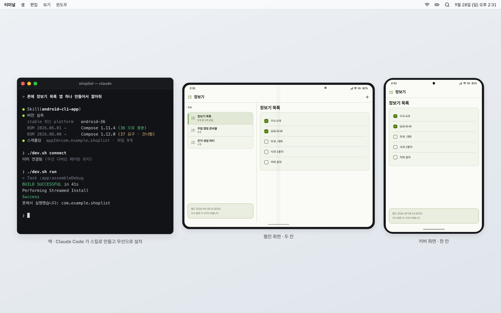
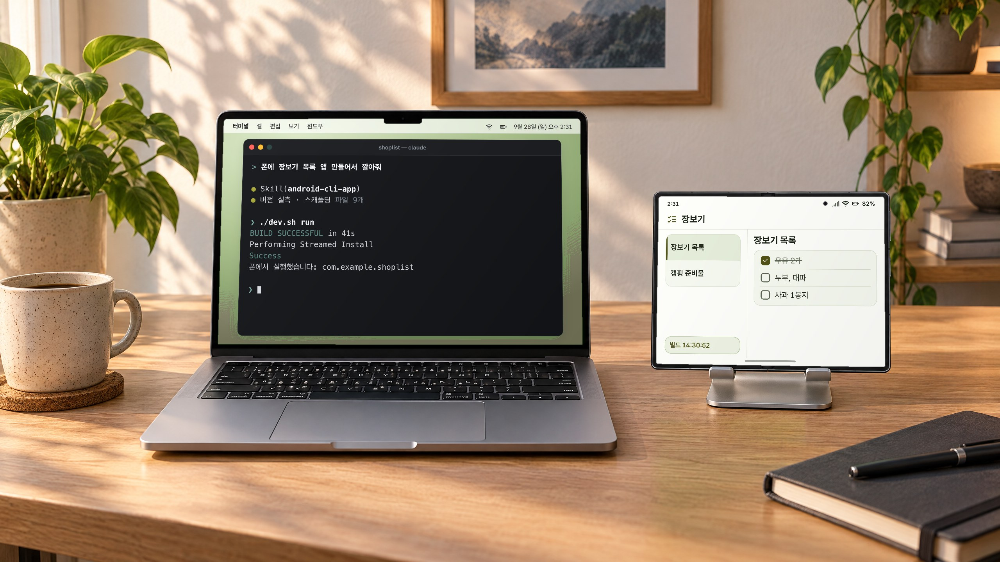
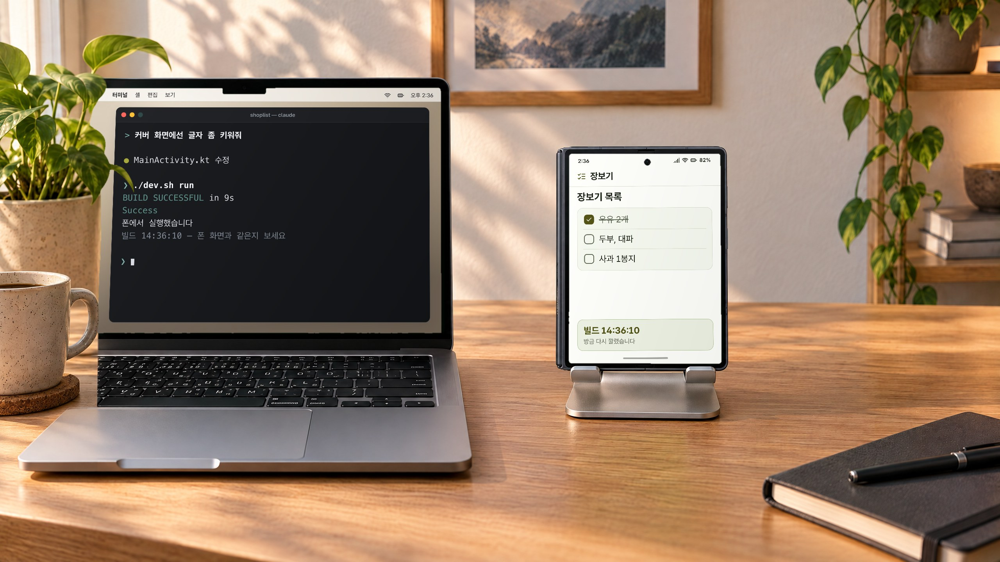
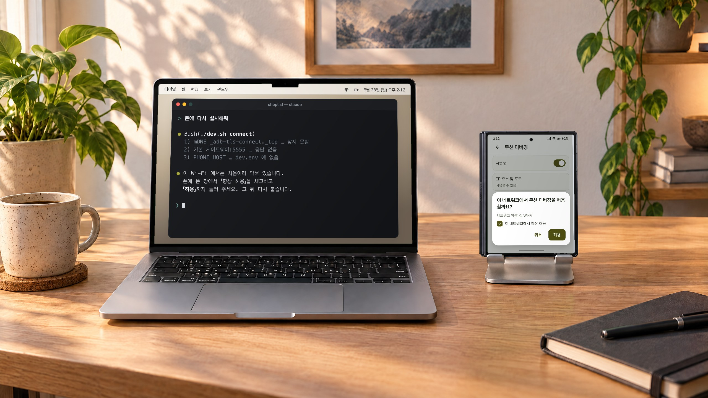
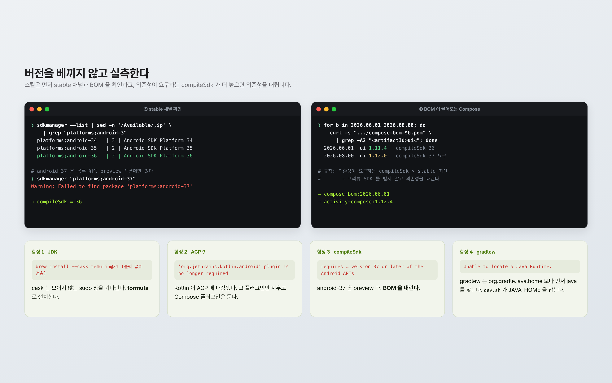
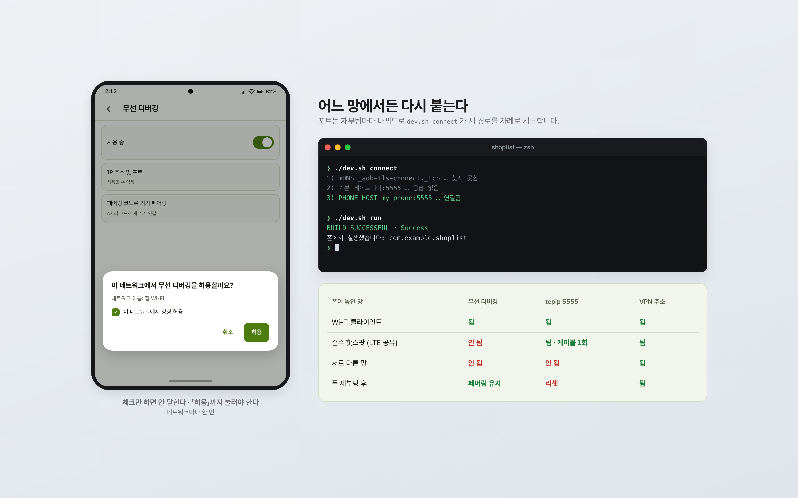
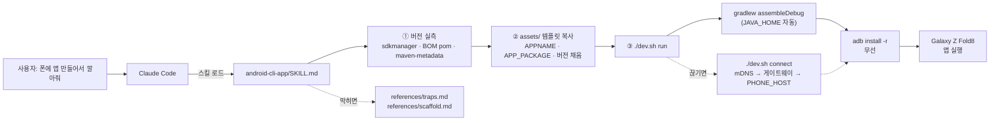
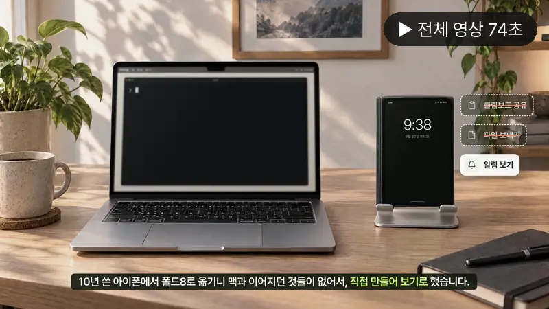

# android-cli-app-skill

Android Studio 없이 터미널만으로 Kotlin/Compose 앱을 만들고, 케이블 없이 무선 adb 로 폰에 설치하는 Claude Code 스킬입니다.

> **English** — A Claude Code skill that scaffolds, builds and installs Kotlin/Compose Android apps from the command line, with no Android Studio.
> It makes the agent check live version data (stable SDK channel, Compose BOM) before writing any Gradle file, and it records the four 2026 toolchain traps (JDK cask, AGP 9 built-in Kotlin, compileSdk 37, gradlew JAVA_HOME).
> A small `dev.sh` handles build → wireless install → launch, and reconnects adb over mDNS, hotspot gateway or a VPN host.

동작 확인: Galaxy Z Fold8 (Android 17) · macOS 26


화면은 설명용 목업입니다.

## 왜 만들었나

저는 10년 동안 아이폰을 쓰다가 갤럭시 Z 폴드8 로 옮겼습니다. 옮기고 나니 아이폰과 맥 사이에서 당연하던 것들
(클립보드 공유, 파일 보내기, 알림 보기)이 없었고, 이걸 남이 만든 앱을 찾는 대신 직접 만들어 보기로 했습니다.
안드로이드는 제가 만든 앱을 제 폰에 바로 넣을 수 있으니까요.

문제는 첫 단계였습니다. JDK 조차 없는 맥에서 시작했고, 4GB 짜리 Android Studio 를 깔고 싶지는 않았습니다.
Claude Code 와 CLI 툴체인(openjdk + Gradle + cmdline-tools)만으로 가 보니 첫 앱이 폰에 무선으로 깔리기까지
35분쯤 걸렸습니다(09:40 무렵 시작, 케이블 없이 다시 설치한 앱의 빌드 시각 10:14 로 확인). 대신 그 35분 동안 인터넷 예제대로 하면 깨지는 함정을 네 개 밟았습니다.

그 과정을 다음 세션의 Claude 가 다시 밟지 않도록 스킬로 굳힌 것이 이 저장소입니다.
이 랩의 안드로이드 앱은 전부 이 방식으로 만들었습니다 — ClipBridge, foldmic, 폴드 에이전트, Claude 기록 앱,
사이버덱, 핀백, cmux 모바일 관제실.

## 실제로 이렇게 씁니다


맥에서 "폰에 앱 만들어서 깔아줘" 한 마디 → 빌드·무선 설치·실행까지 끝나고 옆에 세운 폴드8 에 앱이 열립니다.


고쳐 달라고 한 뒤 다시 깔면 → 커버 화면의 빌드 시각이 바뀌어, 새 버전이 들어갔는지 바로 확인됩니다.


처음 가는 Wi-Fi 에서 연결이 안 되면 → `connect` 가 세 경로를 다 시도하고, 폰의 허용 창을 「허용」까지 누르라고 알려 줍니다.

책상 사진은 AI로 만든 배경이고, 화면은 설명용 목업을 합성했습니다.

## 스크린샷


화면은 설명용 목업입니다.


화면은 설명용 목업입니다.

## 기능

- **버전을 먼저 실측합니다.** stable 채널 최신 platform, BOM 이 끌어오는 Compose 버전, 라이브러리 최신 버전을
  확인하는 명령을 스킬 맨 앞에 두었습니다. 규칙은 하나입니다: *의존성이 요구하는 compileSdk 가 stable 최신보다 높으면
  프리뷰 SDK 를 받지 말고 의존성을 내린다.*
- **스캐폴딩 템플릿** (`assets/`): `settings.gradle.kts`, 루트·앱 `build.gradle.kts`, `gradle.properties`,
  `AndroidManifest.xml`, `MainActivity.kt`(접고 펴면 dp 를 다시 그리는 Hello 화면), `dev.sh`, `.gitignore`,
  `local.properties.example`, `dev.env.example`.
- **빌드 시각 표시**: `BuildConfig.BUILD_TIME` 을 첫 화면에 띄워, 재설치가 실제로 반영됐는지 눈으로 확인합니다.
- **`dev.sh` 개발 루프**
  - `run` — 빌드 → 무선 설치 → 실행. 설치 직후 앱을 한 번 열어 Doze 중 서비스가 안 뜨는 문제를 피합니다.
  - `connect` — mDNS(무선 디버깅) → 기본 게이트웨이:5555(폰 핫스팟) → `PHONE_HOST`:5555(VPN) 순서로 다시 붙습니다.
  - `pair` `build` `install` `log` `devices` `doctor`
- **함정 기록** (`references/traps.md`): 에러 전문, 원인, 해결, 무선 adb 세 경로 비교표.
- **Compose 를 쓸지 판단**: 서비스·퀵 타일·공유 시트 위주의 도구성 앱이면 의존성 0 으로 가라고 권합니다
  (실측 APK 29MB → 2.6MB).

## 구조



```
skills/android-cli-app/
├── SKILL.md                 스킬 본문 (트리거·실측 명령·함정 요약·개발 루프)
├── references/
│   ├── scaffold.md          파일별 최소 내용, placeholder 표, 흔한 첫 실패
│   └── traps.md             함정 4+1 의 에러 전문과 무선 adb 비교
└── assets/                  새 프로젝트에 복사할 템플릿
```

## 준비물

- macOS (Apple Silicon 에서 확인) + Homebrew
- 안드로이드 폰 (개발자 옵션 → 무선 디버깅). 저는 Galaxy Z Fold8 / Android 17 로 확인했습니다.
- Claude Code

툴체인은 스킬이 안내하는 대로 깔면 됩니다(합계 1GB 미만).

```bash
brew install openjdk@21 gradle
brew install --cask android-commandlinetools
export ANDROID_HOME="$HOME/Library/Android/sdk"
curl -sL -o /tmp/pt.zip https://dl.google.com/android/repository/platform-tools-latest-darwin.zip
unzip -oq /tmp/pt.zip -d "$ANDROID_HOME"
yes | sdkmanager --sdk_root="$ANDROID_HOME" --licenses
sdkmanager --sdk_root="$ANDROID_HOME" "platforms;android-36" "build-tools;36.1.0"   # 번호는 실측 후
```

## 설치

스킬 폴더를 Claude Code 의 사용자 스킬 위치로 복사합니다.

```bash
git clone https://github.com/joonlab/android-cli-app-skill.git
mkdir -p ~/.claude/skills
cp -R android-cli-app-skill/skills/android-cli-app ~/.claude/skills/
```

Claude Code 를 새로 열면 "안드로이드 앱 만들어줘", "APK 빌드해줘", "compileSdk 에러" 같은 말에 스킬이 붙습니다.

## 사용 예

Claude Code 에게 그냥 부탁하면 됩니다.

```
> 폰에 장보기 목록 앱 하나 만들어서 깔아줘. 커버 화면에선 한 칸, 펼치면 두 칸으로.
```

스킬 없이 손으로 쓸 때는 이렇게 합니다.

```bash
mkdir -p ~/develop/hellofold && cd ~/develop/hellofold      # 경로는 ASCII 로
A=~/.claude/skills/android-cli-app/assets
cp $A/settings.gradle.kts $A/build.gradle.kts $A/gradle.properties $A/dev.sh .
cp $A/gitignore .gitignore
mkdir -p app/src/main/java/com/example/hellofold
cp $A/app-build.gradle.kts app/build.gradle.kts
cp $A/AndroidManifest.xml app/src/main/
cp $A/MainActivity.kt app/src/main/java/com/example/hellofold/
# APPNAME · APP_PACKAGE · AGP_VERSION · KOTLIN_VERSION · BOM_VERSION · ACTIVITY_VERSION 을 채운다
echo "sdk.dir=$HOME/Library/Android/sdk" > local.properties
gradle wrapper --gradle-version <실측한 버전>
chmod +x dev.sh
./dev.sh doctor
./dev.sh pair <폰IP:페어링포트> <6자리>    # 처음 한 번
./dev.sh run
```

## 설정

코드에 기기 주소나 경로를 박지 않았습니다. 필요한 값은 두 파일에서 읽습니다.

| 파일 | 키 | 뜻 |
|---|---|---|
| `gradle.properties` (커밋) | `appId` | 패키지 이름. `app/build.gradle.kts` 와 `dev.sh` 가 함께 읽습니다 |
| `local.properties` (커밋 안 함) | `sdk.dir` | Android SDK 절대경로. `local.properties.example` 참고 |
| `dev.env` (커밋 안 함, 선택) | `JAVA_HOME` `ANDROID_HOME` | 비우면 자동으로 찾습니다 |
| | `ADB_SERIAL` | 기기가 여러 대 붙어 있을 때 대상 |
| | `PHONE_HOST` | 다른 망에서 붙을 폰 주소(Tailscale 같은 VPN 의 호스트명). `connect` 의 마지막 폴백 |

`dev.env.example` 을 `dev.env` 로 복사해 씁니다.

## 알려진 한계

- **버전표는 2026-09-20 시점 값입니다.** AGP·Compose 는 자주 바뀌므로 스킬은 매번 실측하게 되어 있지만,
  실측 명령 자체(sdkmanager 출력 형식, Maven 경로)가 바뀌면 손봐야 합니다.
- **macOS 에서만 확인했습니다.** `dev.sh` 는 `/usr/libexec/java_home`, `route -n get default` 같은 macOS 명령을 씁니다.
  Linux·Windows 는 확인하지 않았습니다.
- **폰은 Galaxy Z Fold8 한 대로만 확인했습니다.** 다른 기기의 무선 디버깅 메뉴 이름은 다를 수 있습니다.
- **순수 핫스팟(LTE 공유)에서는 최초 1회 케이블이 필요합니다**(`adb tcpip 5555`). 폰을 재부팅하면 다시 필요합니다.
- **공용·회사 Wi-Fi 는 단말 간 통신을 막는 경우가 많아** 무선 adb 가 아예 안 됩니다. 핫스팟, 개인 공유기, VPN 으로 옮겨야 합니다.
- 디버그 APK 만 다룹니다. 서명·릴리스 빌드·스토어 배포는 범위 밖입니다.

## 만든 과정

Claude Code 와 며칠에 걸쳐 만들었습니다. 첫날 오전에 백지 맥에서 첫 앱을 폰에 깔았고, 그 뒤 이틀 동안
맥 연동 도구를 만들며 같은 빌드·설치를 계속 반복했습니다. 그 노하우를 스킬로 정리한 것이 9월 22일입니다.

배운 것 몇 가지:

1. **인터넷 예제가 틀린 게 아니라 낡았습니다.** 네 함정이 전부 2026년에 바뀐 것이었습니다. AGP 9 에서 Kotlin 이 내장되면서
   `kotlin.android` 플러그인이 에러가 됐고, 최신 Compose 는 아직 stable 에 없는 compileSdk 37 을 요구했습니다.
   그래서 스킬 맨 앞에 "이 문서의 버전을 베끼지 말고 실측하라"를 두었습니다.
2. **조용히 멈추는 실패가 제일 비쌉니다.** `brew install --cask temurin@21` 은 에러 없이 sudo 창만 기다리며 멈췄습니다.
   에이전트가 도는 셸에는 TTY 가 없어서, formula(`openjdk@21`)로 바꾸는 것 말고는 방법이 없었습니다.
3. **무선 디버깅의 "사용할 수 없음"은 네트워크 문제가 아니었습니다.** 그 네트워크에서 허용한 적이 없어서였고,
   다이얼로그의 「항상 허용」 체크박스와 「허용」 버튼이 따로라 체크만 하면 닫히지 않았습니다.
4. **문서가 있어도 다음 세션은 몰랐습니다.** 함정은 이미 제 트러블슈팅 노트에 적혀 있었지만, 새 세션의 Claude 는
   그 노트도 제가 만든 도구도 모른 채 같은 길을 다시 찾았습니다. 부족했던 건 지식이 아니라 바로 쓸 수 있는 손이었고,
   그래서 템플릿과 `dev.sh` 를 묶은 스킬로 만들었습니다.

## 홍보 영상

<!-- VIDEO:START -->
### 홍보 영상

[](https://pub-81d14e6ebfb841109968e9c0ee057d1b.r2.dev/android-mac-lab/videos/android-cli-app-skill/android-cli-app-skill_16x9.mp4)

▶ [가로 16:9 · 74초](https://pub-81d14e6ebfb841109968e9c0ee057d1b.r2.dev/android-mac-lab/videos/android-cli-app-skill/android-cli-app-skill_16x9.mp4) · ▶ [세로 9:16 · 62초](https://pub-81d14e6ebfb841109968e9c0ee057d1b.r2.dev/android-mac-lab/videos/android-cli-app-skill/android-cli-app-skill_9x16.mp4) — 영상 속 화면은 설명용 목업이고, 책상 사진은 AI로 만든 배경입니다.
<!-- VIDEO:END -->

## 관련 프로젝트

- 허브: https://github.com/joonlab/android-mac-lab — 폴드8 ↔ 맥 연동랩의 전체 목록과 이야기

## 라이선스

MIT — [LICENSE](LICENSE)
